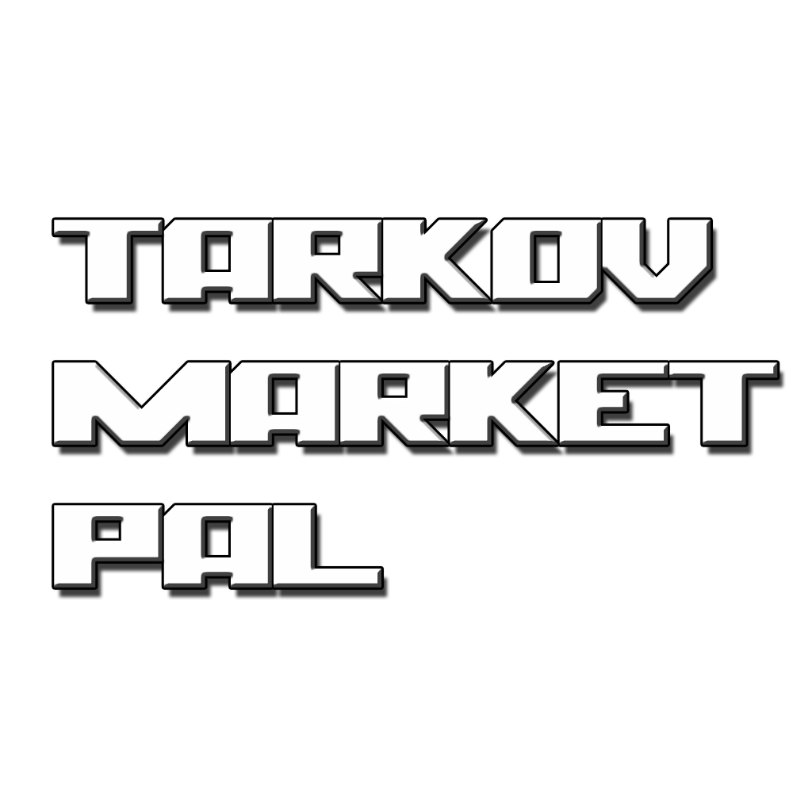

# Tarkov Market Pal

### The Unofficial [Escape From Tarkov](https://www.escapefromtarkov.com/) Price Checker App

## Images

   

## Features

- Search results display the three most relevant results
- Estimated price with time since last updated
- Trader price comparison
- Voice-activated search
- Item price trends (24 hour and 7 days)
- Supports up to six languages
- Save up to five items in favorites for easy access

## Disclaimer
This app is not sponsored, endorsed, or created by Battlestate Games. Any of the trademarks, service marks, collective marks, design rights, personality rights, or similar rights that are mentioned, used, or cited in an Escape from Tarkov Wiki article are the property of their respective owners.

API provided by [Tarkov-Market](https://tarkov-market.com/) (No affiliation)
